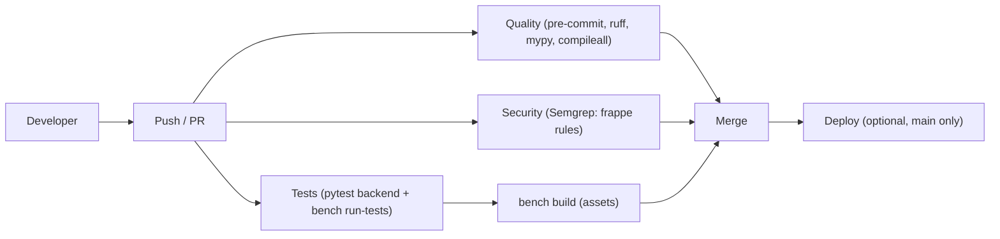

# Codex analysis — CI/CD map & quality gates

Generated: 2026-02-16

This document summarizes the **existing** quality/security/test gates implemented in the `ferum_custom` repo and
how to run equivalent checks locally.

## 1) Local quality gates (pre-commit / pre-push)

Config: `apps/ferum_custom/.pre-commit-config.yaml`

Stages used:

- `pre-commit`: fast formatting/lint checks on changed files
- `pre-push`: heavier checks (ruff full + format check + compileall + backend pytest)

Key hooks (high level):

- Python: Ruff import sorter (`I`), Ruff linter, Ruff formatter
- JS: Prettier + ESLint (limited globs)
- Pre-push: `python -m compileall -q backend ferum_custom telegram_bot scripts`
- Pre-push: backend unit tests via `scripts/precommit/pytest_backend.sh`

Helper installer:

- `apps/ferum_custom/scripts/precommit/install.sh`
  - Sets `PRE_COMMIT_HOME` to a writable dir (falls back to `apps/ferum_custom/.cache/pre-commit`)
  - Installs `pre-commit` and `pre-push` git hooks and patches them idempotently

## 2) GitHub Actions workflows

Directory: `apps/ferum_custom/.github/workflows/`

### 2.1 CI (`ci.yml`)

Jobs:

- `backend_tests`
  - Installs `backend/requirements.txt`
  - Runs `pytest backend/tests`

- `bench_tests`
  - Initializes a clean bench (Frappe/ERPNext `version-15`)
  - Creates `test_site`, installs `erpnext` + `ferum_custom`, runs `bench migrate`
  - Runs `bench --site test_site run-tests --app ferum_custom`
  - Runs `bench build`
  - Optional (main only): `pip-audit`

- `deploy` (optional, main only)
  - Runs only if deploy secrets exist (SSH-based docker compose deploy)

### 2.2 Quality (`linter.yml`)

Jobs:

- `pre_commit`
  - caches `~/.cache/pre-commit`
  - `pre-commit run --all-files`
  - `python -m compileall -q backend ferum_custom telegram_bot scripts`

- `typecheck`
  - installs backend deps
  - runs `mypy` with `pyproject.toml`

### 2.3 Security (`security.yml`)

Job:

- `semgrep`
  - checks out `frappe/semgrep-rules` pinned by `.github/semgrep-rules.version`
  - runs `semgrep scan --config frappe-semgrep-rules/rules --error`

## 3) Recommended local command sequence (equivalent to CI)

Run from **app repo root** (`apps/ferum_custom`), unless stated otherwise.

### 3.1 Repo-only checks (no DB/site needed)

- `pre-commit run --all-files`
- `pre-commit run --all-files --hook-stage pre-push`

### 3.2 Bench + site checks (requires running DB + site)

Run from **bench root** (`/home/frappe/frappe-bench`):

- `bench --site test_site migrate`
- `bench --site test_site run-tests --app ferum_custom`
- `bench --site test_site execute ferum_custom.setup.audit.run --kwargs "{'write_report': 1}"`

Optional (if validating assets):

- `bench build --app ferum_custom`

## 4) Runtime audit as a production guardrail

Runtime audit entrypoint (non-secret, writes JSON to `apps/ferum_custom/docs/audit/`):

- `bench --site <site> execute ferum_custom.setup.audit.run --kwargs "{'write_report': 1}"`

Audit checks include:

- imports for active hook targets
- DocType meta load for module `Ferum Custom`
- Query Report execution with empty filters (prevents UI 500 regressions)
- workflow references to missing DocTypes
- workspace shortcut consistency (“Объекты” regressions)
- system health summary (Drive/Telegram/FastAPI/Vault + security validation)

## 5) CI/CD flow diagram

