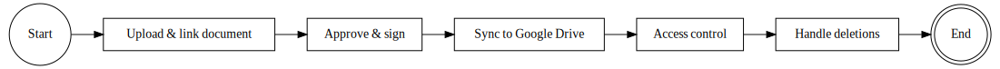

# Документы и вложения (ERPNext `File` + Google Drive)

### Figure 6: Document & Attachment Management BPMN

Документ фиксирует **AS‑IS реализацию** работы с файлами в Ferum ERP: где и как хранятся документы (сервер/Google Drive), какие метаданные обязательны, и как устроены проверки прав доступа.

Ключевой принцип: **используем стандартный DocType `File`** и Drive‑интеграцию. Отдельные “обёртки” (`Custom Attachment`) остаются только как legacy‑контур там, где они уже встроены в модели.

См. также:

- структура папок на Drive: `docs/runbooks/google_drive_structure.md`
- типы проектных документов: `ferum_custom/services/project_documents_config.py`
- серверная валидация File‑метаданных: `ferum_custom/services/project_documents.py`
- API загрузки/листинга документов: `ferum_custom/api/project_documents.py`
- контроль доступа к файлам: `ferum_custom/security/file_permissions.py`

---

## 1) Сценарии хранения файлов (AS‑IS)

В системе параллельно используются несколько сценариев:

1) **Проектные документы (юридически значимые):** сканы договоров/писем/актов и т.п.  
   Хранение: **Drive‑first**, в ERP создаётся `File` со ссылкой на Drive.

2) **Desk‑вложения в карточках (операционные):** вложения/фото в `Service Request` и т.п.  
   Хранение: стандартные ERPNext вложения (`File` в `sites/*/public|private`), без обязательной загрузки в Drive.

3) **Bot‑доказательства/вложения:** файлы из Telegram загружаются **напрямую в Drive** в папки объекта/заявки, а в ERP сохраняются ссылки (комментарии/поля).

4) **Legacy `Custom Attachment`:** используется в отдельных местах (например, документы в `Service Report`). Может загружать файл в Drive без проектной структуры.

---

## 2) Проектные документы (основной юридический контур)

### 2.1 Что считается “проектным документом”

Проектный документ — это запись `File`, созданная через Ferum‑UI/endpoint и идентифицируемая так:

- `attached_to_doctype = Project`
- `attached_to_field = ferum_project_documents`

Серверная валидация `File.validate` применяется только к таким `File`:  
`ferum_custom/services/project_documents.py`.

### 2.2 Обязательные метаданные

Для юридически значимых документов обязательны:

- `ferum_doc_title` — наименование документа
- `ferum_doc_type` — тип документа (строгий whitelist)
- `ferum_drive_file_id` — ID файла на Google Drive
- `file_url` — Drive `webViewLink`

Опционально:

- `ferum_contract` — договор (если указан, валидируется, что он соответствует `Project.contract`)

### 2.3 Где физически хранятся файлы

Файл загружается **напрямую в Google Drive**, затем создаётся `File` со ссылкой:

- `file_url = <Drive webViewLink>`
- `is_private = 0` (доступ всё равно контролируется через ERP permissions/PQC)

Папки создаются детерминированно (идемпотентно):

- корень Drive (настройка) → `01_ОРГАНИЗАЦИЯ_*` → `01_ПРОЕКТЫ` → `<PROJECT_ID>`
- внутри проекта: `01_ДОКУМЕНТЫ/` + подкаталоги по типам/периодам

Роутинг по папкам реализован в `ferum_custom/api/project_documents.py` (`_doc_type_folder_segments`).

### 2.4 Контекст проекта обязателен

Загрузка “вне проекта” запрещена на сервере:

- `upload_project_document` требует `project` и проверяет доступ пользователя к проекту
- `upload_contract_document` требует `contract`, но всё равно привязывает документ к связанному `Project`

### 2.5 Права доступа

- загрузка: роль ∈ `UPLOAD_ROLES` + доступ к проекту (`user_has_project_access`)
- просмотр: доступ к проекту
- **Client**: просмотр ограничен whitelist типов (`CLIENT_ALLOWED_TYPES`)

Реализация: `ferum_custom/security/file_permissions.py`.

---

## 3) Вложения заявок и доказательства (операционный контур)

### 3.1 Desk‑вложения

`Service Request` хранит вложения как стандартные поля:

- `attachments` (Table → `Document Attachment Item`, поле `Attach`)
- `photos` (Table → `Request Photo Attachment Item`, поле `Attach Image`)

Физически это `File` в директории сайта.

### 3.2 Bot‑вложения (Drive‑first, без `File`)

Telegram‑бот загружает файлы в Drive и фиксирует ссылку в ERP:

- “обследование” → папка объекта по секции чек‑листа (`upload_survey_evidence`)
- вложения заявки → `02_ЗАЯВКИ/<SERVICE_REQUEST>/` (`upload_service_request_attachment`)

Код: `ferum_custom/api/telegram_bot.py`.

---

## 4) Удаление файлов (AS‑IS)

- `Custom Attachment`: при удалении записи удаляется и файл на Drive (`on_trash`).
- `File` (проектные документы): **удаление `File` не удаляет файл на Drive** (в текущей реализации нет hook‑а на удаление Drive‑файла).

Причина: без безопасного “reference counting” удаление в облаке может привести к потере доказательной базы.

---

## 5) Риски и ограничения

- Модель хранения смешанная: Drive‑first для “Документов проекта” и bot‑вложений, локальные файлы для Desk‑вложений.
- Legacy `Custom Attachment` не использует проектную структуру Drive и должен постепенно вытесняться.
- Для юридически значимых файлов рекомендуется использовать именно “Документы проекта” (Drive‑first + метаданные + строгие проверки доступа).
